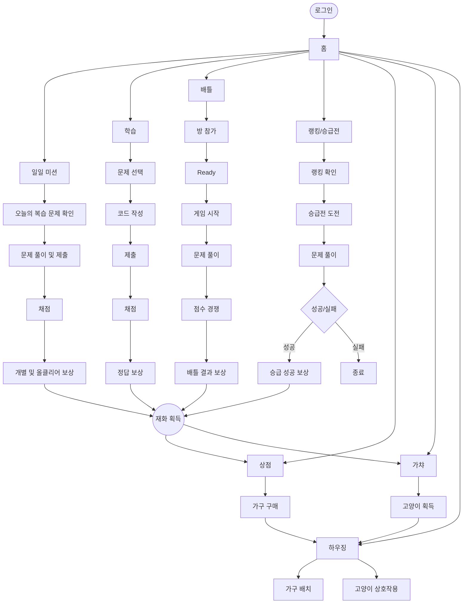

# 게임 시나리오 문서

이 폴더의 목적은 **기능 목록을 나열하는 것**이 아니라, 사용자가 로그인한 뒤 실제로 게임을 이용하는 순서를 따라가면서 각 단계에서 무슨 일이 일어나고 어떤 변수가 발생할 수 있는지 이해할 수 있게 만드는 것이다.

## 전체 흐름

현재 기준 사용자 흐름은 다음과 같다.



> 사용자가 제공한 원본 흐름 이미지는 현재 이 채팅에서 확인했으나, GitHub 커넥터의 텍스트 파일 쓰기 경로로는 첨부 PNG 바이너리를 그대로 업로드할 수 없어 이번 커밋에는 동일 흐름을 Mermaid로 먼저 반영했다. 원본 PNG가 저장소 파일로 제공되면 `scenario/assets/full_flow.png`로 교체할 수 있다.

## 폴더 구조

```text
scenario/
├─ README.md
├─ by_function/
│  ├─ 00_common/
│  ├─ 01_learning_grading/
│  ├─ 02_gacha/
│  ├─ 03_battle/
│  ├─ 04_rank_challenge/
│  ├─ 05_auth/
│  ├─ 06_housing/
│  ├─ 07_shop/
│  ├─ 08_attendance/
│  └─ README.md
└─ by_flow/
   ├─ 01_daily_mission/
   ├─ 02_learning/
   ├─ 03_battle/
   ├─ 04_ranking_promotion/
   ├─ 05_shop/
   ├─ 06_gacha/
   ├─ 07_housing/
   └─ 08_currency/
```

## 두 문서 축의 역할

### `by_flow/` — 먼저 읽는 문서

사용자가 실제로 게임을 사용하는 순서대로 읽는다. 각 단계는 다음 질문에 답해야 한다.

1. 이 단계의 목적은 무엇인가?
2. 정상적인 경우 사용자는 무엇을 하고 서버는 무엇을 하는가?
3. 어떤 변수·예외·분기가 생길 수 있는가?
4. 그 변수는 왜 생기는가?
5. 시스템은 어떻게 감지하는가?
6. 서버·DB는 어떻게 처리해야 하는가?
7. 사용자에게 어떤 UI/메시지를 보여줘야 하는가?
8. 재시도·중복 요청·동시성·네트워크 단절은 어떻게 처리하는가?
9. 다음 단계로 넘어가는 조건은 무엇인가?
10. 다음 단계에 어떤 영향을 주는가?
11. 무엇을 테스트해야 하는가?

### `by_function/` — 상세 근거 문서

기존에 작성된 기능/API/DB 중심 시나리오를 **삭제하지 않고 그대로 보존**한 영역이다. `by_flow`를 읽다가 특정 API 계약, DB 상태, 동시성 정책, Docker 채점, 에러 규칙 등의 상세 근거가 필요할 때 참고한다.

## 권장 읽기 순서

`scenario/README.md` → `by_flow`의 해당 사용자 흐름 → 필요할 때 `by_function`의 기능별 상세 문서 순서로 읽는다.

## 작성 원칙

- 아직 팀에서 확정하지 않은 비즈니스 수치는 임의로 확정하지 않는다. 가챠 비용·확률·천장, 승급 합격 기준, 보상 액수, 재화 체계 등이 미정이면 `TBD`로 표시한다.
- 프론트 버튼 비활성화만으로 정합성을 보장하지 않는다. 재화 차감, 중복 보상, 방 정원, 보상 지급 등은 서버/DB에서 다시 검증한다.
- Docker 채점처럼 오래 걸리는 외부 작업 동안 DB 트랜잭션/row lock을 유지하지 않는다.
- 같은 요청이 재전송될 수 있다는 전제로 중복 제출·중복 지급·중복 구매를 검토한다.
- 정상 흐름뿐 아니라 실패 후 복구 흐름까지 반드시 적는다.
